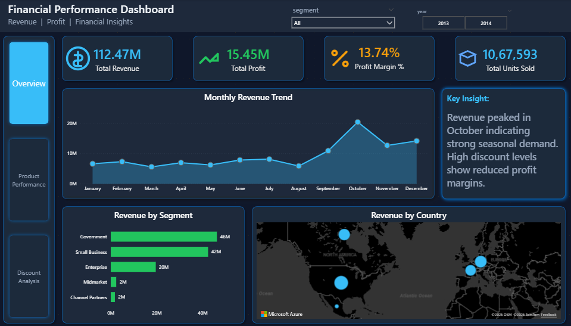
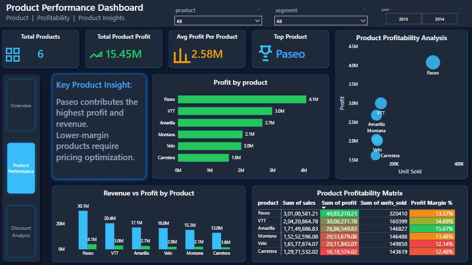
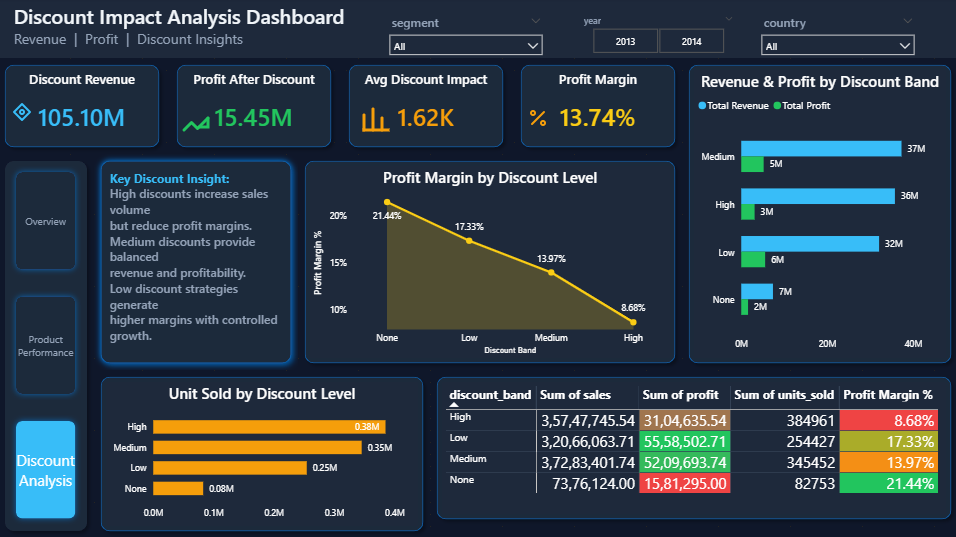

# 📊 Financial Performance & Profitability Analytics Dashboard  
**SQL + Power BI End-to-End Data Analytics Project**

---

# 📌 Project Overview

This project presents an **end-to-end Financial Performance and Profitability Analytics Dashboard** developed using **MySQL and Power BI**.

The objective of this project is to analyze **revenue trends, product profitability, and discount strategies** to generate actionable insights that support business decision-making.

This project demonstrates strong skills in:

- SQL Data Cleaning & Transformation
- Business Analysis
- KPI Development
- Financial Data Visualization
- Interactive Dashboard Design
- Data Storytelling

---

# 🎯 Business Objectives

This dashboard answers key business questions:

• What is the overall revenue and profit performance?  
• Which products generate the highest profit?  
• How do discount levels impact profitability?  
• What seasonal trends exist in revenue?  
• Which discount strategies maximize profit margins?  

---

# 🛠️ Tools & Technologies Used

**Database:**  
MySQL Workbench  

**Data Visualization:**  
Power BI  

**Data Processing:**  
SQL  

**Other Tools:**  
Microsoft Excel  
GitHub  

---

# 📊 Dashboard Pages Overview

This dashboard consists of **3 interactive pages** designed to analyze financial performance from multiple business perspectives.

---

# 📍 Page 1 — Financial Overview Dashboard

The **Financial Overview Dashboard** provides a high-level summary of overall business performance.  
This page helps stakeholders quickly understand revenue trends, profitability, and regional performance.

## Key Features

✔ Total Revenue KPI  
✔ Total Profit KPI  
✔ Profit Margin %  
✔ Total Units Sold  
✔ Monthly Revenue Trend Analysis  
✔ Revenue by Business Segment  
✔ Revenue by Country Map  
✔ Executive Insight Panel  

## Key Insight

Revenue peaked in **October**, indicating strong seasonal demand.  
Higher discount levels show reduced profit margins, highlighting the need for optimized pricing strategies.

---

## 📷 Dashboard Preview — Financial Overview

---

# 📍 Page 2 — Product Performance Dashboard

The **Product Performance Dashboard** focuses on product-level analysis to identify top-performing products and profitability trends.

This page helps businesses determine which products generate the most revenue and profit while identifying lower-performing items.

## Key Features

✔ Total Products KPI  
✔ Total Product Profit  
✔ Average Profit per Product  
✔ Top Performing Product  
✔ Profit by Product Visualization  
✔ Revenue vs Profit Comparison  
✔ Product Profitability Scatter Chart  
✔ Product Profitability Matrix  

## Key Insight

**Paseo** is the highest-performing product contributing significantly to both revenue and profit.  
Lower-margin products require pricing optimization to improve profitability.

---

## 📷 Dashboard Preview — Product Performance

---

# 📍 Page 3 — Discount Impact Analysis Dashboard

The **Discount Impact Analysis Dashboard** evaluates how discount strategies affect revenue, sales volume, and profitability.

This page enables businesses to determine the most effective discount strategies without reducing profit margins.

## Key Features

✔ Discount Revenue KPI  
✔ Profit After Discount KPI  
✔ Average Discount Impact  
✔ Profit Margin %  
✔ Revenue & Profit by Discount Band  
✔ Profit Margin Trend by Discount  
✔ Units Sold by Discount Level  
✔ Discount Performance Matrix  

## Key Insight

High discount levels increase sales volume but significantly reduce profit margins.  
Balanced discount strategies help maintain profitability while supporting revenue growth.

---

## 📷 Dashboard Preview — Discount Analysis

---

# 🧮 SQL Data Processing

Data preparation was performed using SQL to ensure clean and structured data for analysis.

Key SQL tasks performed:

✔ Data Cleaning  
✔ Removing Duplicates  
✔ Handling Missing Values  
✔ Aggregation Queries  
✔ Creating Summary Tables  
✔ Calculating Revenue & Profit Metrics  

---

# 📈 Key Metrics Calculated

The following important business metrics were created:

✔ Total Revenue  
✔ Total Profit  
✔ Profit Margin %  
✔ Units Sold  
✔ Revenue by Segment  
✔ Profit by Product  
✔ Discount Impact Analysis  
✔ Monthly Revenue Trends  

---

# 📂 Project Folder Structure
Financial-Analytics-Project/

│── dataset/
│     Financial_Sample.xlsx
│
│── 
│     financial_analysis_queries.sql
│
│── Overview.png
│── Product_Performance.png
│── Discount_Analysis.png
│
│── Financial_Performance_Dashboard.pbix
│
│── README.md

---

# 🚀 How to Use This Project

Follow these steps to run this project:

1. Import dataset into MySQL  
2. Run SQL queries from the SQL folder  
3. Load processed data into Power BI  
4. Open the Power BI file (.pbix)  
5. Interact with dashboard visuals  

---

# 📌 Skills Demonstrated

This project demonstrates the following technical and analytical skills:

✔ SQL Data Cleaning  
✔ Data Transformation  
✔ Business Intelligence  
✔ Dashboard Design  
✔ Data Visualization  
✔ Financial Analytics  
✔ KPI Development  
✔ Data Storytelling  

---

# 📊 Dashboard Highlights

✔ Interactive slicers  
✔ Dynamic filtering  
✔ Conditional formatting  
✔ Multi-page navigation  
✔ Professional dark theme  
✔ Business-focused insights  

---

# 👨‍💻 Author

**Ajay Kumar**  
Data Analyst | Power BI | SQL | Excel  

📧 Email:  
ajthakur7273@gmail.com  

🔗 LinkedIn:  
https://www.linkedin.com/in/ajay6469  

🔗 GitHub:  
https://github.com/ajay-data-analyst  

---

# ⭐ Project Summary

This project demonstrates an **end-to-end financial analytics workflow**, including data preparation, transformation, visualization, and business insight generation using SQL and Power BI.

The dashboard enables stakeholders to monitor performance trends, identify profitable products, and optimize discount strategies for improved financial outcomes.
